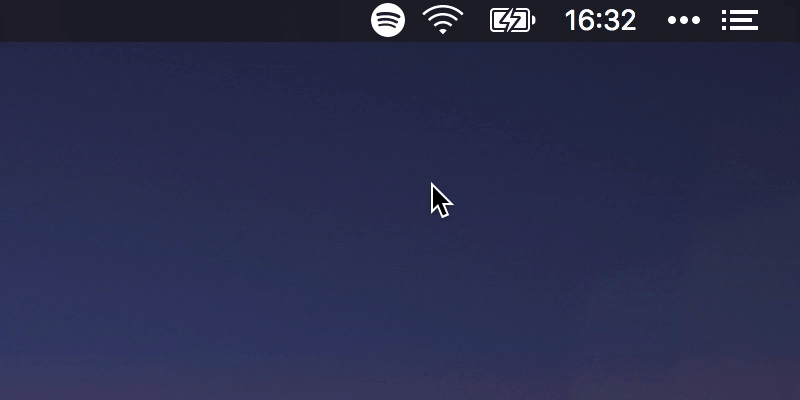

# bitbar-spotify-now-playing

> 🎧 Simple "now playing" Spotify plugin for BitBar

## Installation

See official BitBar guide for [installing plugins](https://github.com/matryer/bitbar#installing-plugins).

## Features

- Displays currently playing artist & track
- Displays artist, album and track in dropdown
- Ability to launch Spotify from dropdown when not already running

## License

This project is licensed under the MIT License - see the [LICENSE.md](LICENSE.md) file for details.
