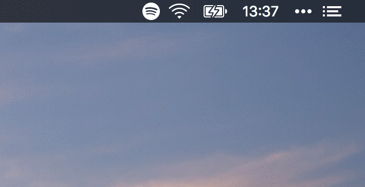

<h3 align="center">Spotify Now Playing</h3>

🎧 Simple now playing Spotify plugin for BitBar

## Installation

See official BitBar instructions for [installing plugins](https://github.com/matryer/bitbar#installing-plugins).

## Features

- Launch Spotify from dropdown when not already running
- Display currently playing artist & track
- Display artist, album and track in dropdown

## License

This project is licensed under the MIT License - see the [LICENSE.md](LICENSE.md) file for details.
